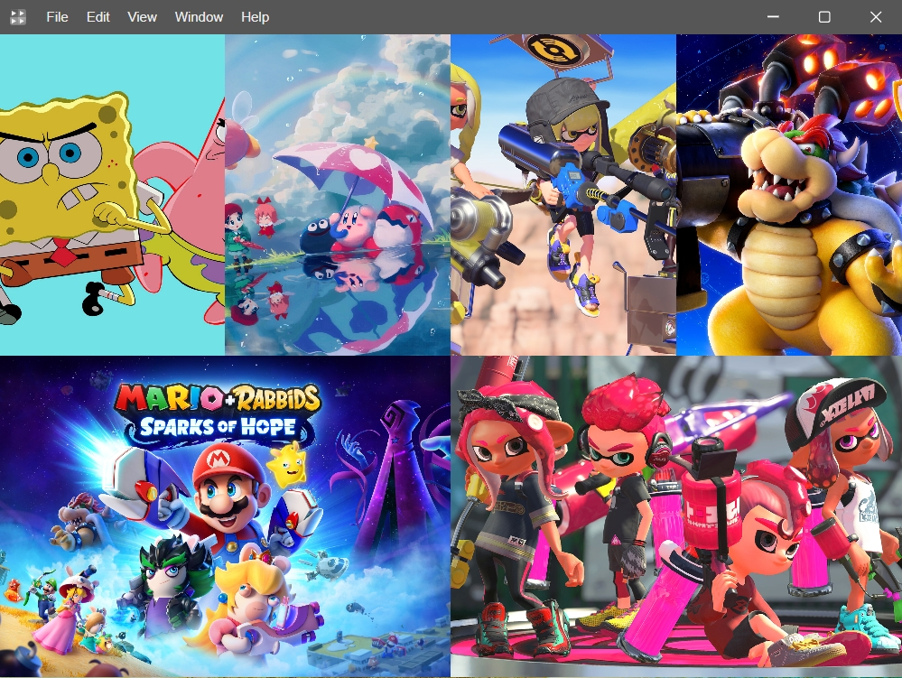

# GridPlayer播放器

参考项目:<https://github.com/vzhd1701/gridplayer>

本项目基于Electron开发,实现同时播放多个视频的功能;特点是：缩放窗口大小，自由布局，设置背景颜色，可预览图片，视频,文本，代码等，支持保存窗口布局，列表清单，放大移动窗口中心，支持JavaScript脚本编写/脚本运行/播放脚本结果；

## 使用主要框架

- Electron（桌面开发）
- Vue3|Vite|Ts（UI）
- GridStack.js（窗口布局）
- Ace.js（代码展示/格式化）
- Xgplayer.js（西瓜视频播放器）
- Express.js（资源服务器）
- fluent-ffmpeg.js（Todo:视频下载）

## 展示

## 运行

- npm install
- npm run dev

> 国内设置Electron下载镜像 `$env:ELECTRON_MIRROR="https://npmmirror.com/mirrors/electron/"` [链接](https://electronjs.p2hp.com/docs/latest/tutorial/installation)
