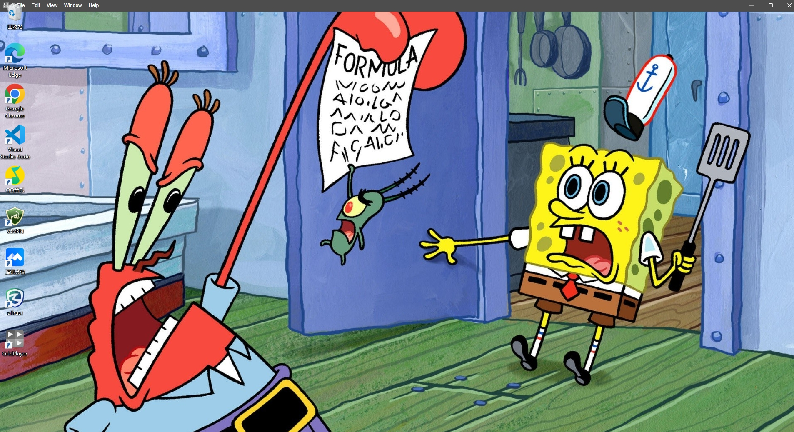

# GridPlayer播放器

参考项目:<https://github.com/vzhd1701/gridplayer>

本项目基于Electron开发,实现同时播放多个视频的功能;特点是：缩放窗口，自由布局，设置背景，预览图片，视频,文本，代码，保存窗口布局，列表清单，放大移动窗口中心，JavaScript脚本编写/脚本运行/播放脚本结果；视频下载（需自行下载ffmpeg并配置环境变量），窗口置底（相当于壁纸仅win10及以上）

## 使用主要框架

- Electron（桌面开发）
- Vue3|Vite|Ts（UI）
- GridStack.js（窗口布局）
- Ace.js（代码展示/格式化）
- Xgplayer.js（西瓜视频播放器）
- Express.js（资源服务器）
- fluent-ffmpeg.js（视频下载）
- electron-as-wallpaper（win10以上设置为壁纸）

## 展示

## 运行

因为使用了electron-as-wallpaper(编译c++到nodejs实现置底功能),需配置添加node-gyp环境，改目前插件只支持win10以上版本（win10:bug多个扩展屏只识别从左至右第一个,而非主屏，应该是跟获取win-form窗体顺序有关）

- 安装最新版python(添加环境变量)
- 安装visual c++桌面 ☑️勾选MSVC编译工具 ☑️win10 SDK
- npm install -g node-gyp
- cd your project
- npm install
- npm run dev

> 国内设置Electron下载镜像（环境变量只在powershell生命周期内生效） `$env:ELECTRON_MIRROR="https://npmmirror.com/mirrors/electron/"` [链接](https://electronjs.p2hp.com/docs/latest/tutorial/installation)
